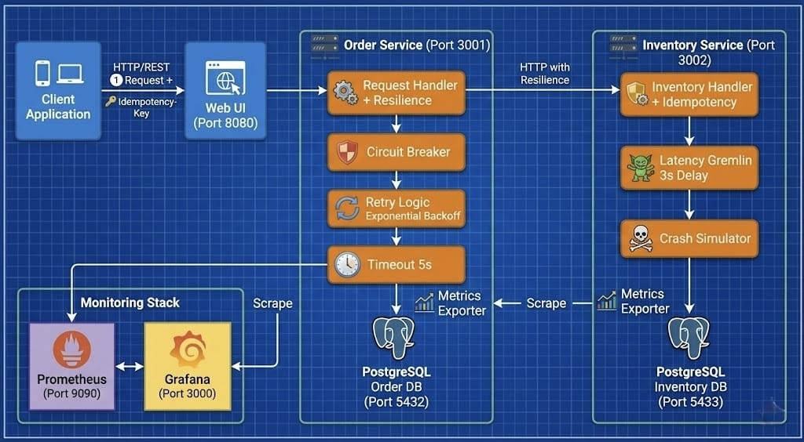

# Valerix System Architecture

## Overview

The Valerix e-commerce system is designed as a resilient, distributed microservices architecture. It handles order processing with advanced reliability patterns to ensure data consistency and system stability even under failure conditions.

## Component Breakdown

### 1. Client Layer
- **Client Application**: Mobile/Desktop clients initiating requests.
- **Web UI (Port 8080)**: Serves as the entry point, handling user interactions and visualizing system state.

### 2. Service Layer
- **Order Service (Port 3001)**:
  - **Request Handler**: Processes incoming order requests.
  - **Resilience**: Implements Circuit Breaker, Retry Logic (Exponential Backoff), and Timeouts (5s).
  - **Idempotency**: Ensures requests are processed exactly once using idempotency keys.
  - **Database**: Connects to `order_db` PostgreSQL.
  
- **Inventory Service (Port 3002)**:
  - **Inventory Handler**: Manages stock levels and product data.
  - **Chaos Engineering**:
    - **Latency Gremlin**: Injects artificial delays (e.g., 3s) to test resilience.
    - **Crash Simulator**: Simulates random or deterministic crashes to test recovery.
  - **Database**: Connects to `inventory_db` PostgreSQL.

### 3. Data Layer
- **PostgreSQL Databases**: Dedicated instances for Order and Inventory services (Ports 5432 & 5433).
- **Backup System**:
  - **Backup Service**: Dedicated container for automated data protection.
  - **Persistent Volume**: `backup-storage` stores encrypted, compressed backups.
  - **Strategy**: Incremental local backups every 4 hours + single daily external sync.

### 4. Observability Stack
- **Prometheus (Port 9090)**: Scrapes metrics from both services (endpoints `/metrics`).
- **Grafana (Port 3000)**: Visualizes metrics with pre-built dashboards for system health, circuit breaker state, and business KPIs.

## Key Flows

1. **Order Creation**: Client -> Web UI -> Order Service -> Inventory Service (with resilience).
2. **Failure Handling**: If Inventory Service is slow/down, Order Service retries or opens circuit breaker.
3. **Monitoring**: Prometheus pulls data every few seconds; Grafana displays real-time status.
